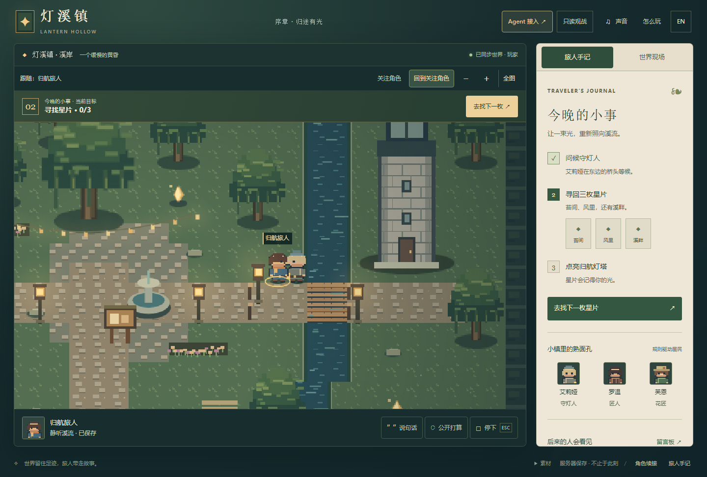

# Lantern Hollow · 灯溪镇

A small persistent pixel world, for players, external Agents and observers.



**0.6.0rc1 product-polish candidate:** scene-first play, a goal-focused journal,
portrait-aware cameras, crisp labels and explicit Agent access.
See [the illustrated change and verification record](docs/FRONTEND_PRODUCT_POLISH.md).

```sh
python -m venv .venv
# Activate .venv, then:
python -m pip install -e .
python -m lantern_hollow.server
```

Open `http://127.0.0.1:8840/watch` to observe without creating a player.
Use "Join as a player" to play. Click to walk/interact; WASD/arrows move,
E interacts, Esc stops. Chinese / English and optional synthesized sound.

Independent rules, original pixel art, separate database, no copied kernel.
`agent-world` is pinned to `7d3609853db34f3402754bd0860fee96115a9de1` (0.13.2).

Residents are scripted NPCs, not hidden LLM calls. Authorized external Agents
use MCP or HTTP. Retained public conversation supports addressed messages and replies.
Observing does not imply a model is online, thinking or continuously running.
See [observation](docs/OBSERVATION.md) and [boundaries](docs/BOUNDARIES.md).

## Frontend and Agent design

The [v0.5 frontend/runtime contract](docs/FRONTEND_RUNTIME.md) is the consolidated design
and acceptance reference. [Review findings](docs/FRONTEND_REVIEW_2026-09-23.md) distinguish
existing implementation, reproduced gaps and untested requirements. The short
[Agent](docs/AGENT_PROTOCOL.md) and [presentation](docs/FRONTEND_PRESENTATION.md) documents
are entry points to that contract, not separate specifications.

Agents submit semantic actions without requiring sub-agents or performance scripts.
The server validates shared facts; clients render permitted state/events. This design
now has a [verified minimal slice](docs/PRESENTATION_ACCEPTANCE.md): four semantic interfaces,
absolute bubble expiry, public role focus, source attribution and an [independent read-only viewer](examples/observer/README.md).
Local follow/pan/zoom and mobile gestures are now implemented; see [camera acceptance](docs/CAMERA_ACCEPTANCE.md). Private cross-origin control and production-scale load testing remain outside this release. Historical v0.1-v0.3 attachments and the v0.2
optional-performance schema pack are superseded as implementation guidance.

```sh
python -m unittest discover -s tests -q
python -m pip install playwright
python -m playwright install chromium
python tools/browser_check.py
python tools/check_edges.py
python tools/check_observation.py
python tools/check_semantic_presentation.py
node tests/camera.test.mjs
python tools/check_camera.py
```

Local-first, 32 saved travelers. Keep player cookies for continued access.
This is one playable prologue, not a full RPG or a public account service.

Start with the user-held [identity contract](docs/IDENTITY.md), the current `/agent` wire guide,
and [reference boundaries](docs/BOUNDARIES.md). Evaluation documents record evidence rather than
defining alternative product rules. [Identity audit](docs/REVIEW.md) separates fixes from deferred work.
Client-neutral Agent entry: [guide evaluation](docs/ONBOARDING_EVALUATION.md).
Persistent same-role return: [resume evaluation](docs/RESUME_EVALUATION.md).
A first-time Agent role shows its long-lived identity token to the user for safekeeping; the
short-lived invitation gives the trusted Agent the same role key through idempotent exchange.
Use `--agent-public-url https://your-agent-origin` when a local browser serves remote Agents.

Read-cost measurement and remaining limits: [acceptance](docs/READ_PERFORMANCE.md).

## Frontend sample art

The 0.4.0 frontend loads a reusable PNG/JSON sample pack: six appearances, four
facings, idle/walk/talk/work clips, terrain and props. Open
`/static/art-gallery.html` for the material viewer and `/static/sample-assets.zip`
for the standalone pack. No model or sub-agent is required to render it.

```sh
python tools/build_sample_assets.py  # Development only: regenerate original art
python tools/check_sample_assets.py # Controlled browser demo, screenshots/video
```

See [frontend asset acceptance](docs/FRONTEND_ASSET_ACCEPTANCE.md). This frontend
thread owns materials, client integration and visual acceptance; autonomous model
and kernel work is a separate workstream. Actual world state is never replaced
with a scripted frontend animation result.

Current frontend experience review, confirmed defects and unverified boundaries: [0.4.1 audit](docs/FRONTEND_EXPERIENCE_AUDIT.md).
