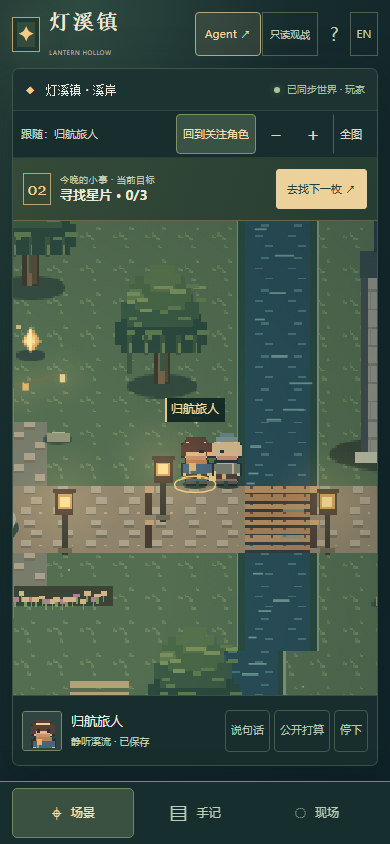

# 前端产品打磨：0.6.0rc1

范围：灯溪镇的官方 2D 客户端与对应浏览器验收。基线为 `f90912e13938b13ee97006f6aececc667bf46fc4`，独立分支 `feat/frontend-product-polish`。这不是重写世界内核，也不是全部设备的正式发布认证。

## 这轮解决什么

本轮实际打开旧版的公开入口、加入表单、玩家页面和手机页面后，主要问题是：世界记录抢占玩家目标的位置；手机场景被横屏比例和换行工具栏压缩；姓名文字和像素角色一起放大导致中文发虚；开发说明占据主要界面。

| 部分 | 本轮实现 |
|---|---|
| 整体视觉 | 深绿场景框架与浅色纸张手记分工，统一字体、按钮、边框、间距和焦点样式。保留已有像素美术，不冒充重新生成素材。 |
| 信息层级 | 进入后默认自己的手记；世界现场独立面板。场景上方持续显示当前目标与下一步行动，目标来自授权快照。 |
| 手机体验 | 真正按容器比例调整场景视口；场景、手记、现场分开。角色操作区位于底栏上方，不再被遮挡；中英文窄屏分别验证。 |
| 镜头与标注 | 世界尺寸与视口尺寸分离，保留缩放反向映射、点选身份和本地镜头。跟随使用平滑过渡；高清独立文字层保持像素画清晰而中文可读。 |
| 行动反馈 | 已接受路径只显示尚未走完的部分，地面关注环与目标提示更明确。进度依据服务器时间，到期但未收到结果时明确等待确认。 |
| 首次进入 | 区分公开关注、已有 Agent 令牌续接、新建直接控制的旅人。不会把知道角色 ID 当作控制授权，也不会声称打开网页就唤醒外部 Agent。 |
| 弹窗和键盘 | 完成结果使用原生模态对话框；关闭面板返回场景焦点。输入法、输入框、弹窗及手机面板不应触发场景移动。 |
| 运行开销 | 缓存灯光和暗角绘制素材，隐藏页面跳过场景绘制，结束的音频节点主动断开。不由这些代码变化推算帧率提升百分比。 |

## 一个额外修复的操作漏洞

在动作响应丢失、连续回执查询也失败之后，再次提交同一表单，旧版会先找回旧回执，然后继续生成一个新的动作请求。本轮让同一操作的重试消费原回执，不另造操作 ID。

同一个故障脚本在基线记录到两个不同的动作请求，在候选实现只记录到一个，并清理待确认状态。这里证明的是避免重复提交；不把请求计数夸大成两个动作都被世界接受。

## 实际画面

下列是运行中的程序截图，不是设计稿。只含本轮创建的测试角色。




## 验证方式与证据

汇总和逐项结果见 [verification.json](frontend-polish/verification.json)。截图是本轮实际操作得到的画面，原始日志和失败尝试留在本轮本地 evidence 目录；仓库保留可复核摘要和回归脚本。

本轮除新流程验收外，继续检查原来的入场、任务、发言、观察、Agent 邀请与续接、语义表现、素材替换、身份命中和故障恢复。旧脚本里已经移走的手机入口，改为点击新版真实可见的入口；原本写死 640×416 的屏幕边界改为读取实际视口，不删除身份、授权或避让断言。

曾发现的手机英文标题溢出、底栏覆盖操作区、浅色手记的居民说明对比度不足，均有失败证据及后续修正。自动无障碍结果中的“未能判断”不被算作完整认证。

### 本地复跑

完成项目依赖、Node 与 Playwright 浏览器安装后，在仓库根目录执行：

```sh
python -m unittest discover -s tests -q
python tools/check_product_polish.py --output test-results/my-product-check
python tools/check_receipt_retry.py --output test-results/my-receipt-check
python tools/check_browser_matrix.py --axe tools/qa/node_modules/axe-core/axe.min.js --output test-results/my-browser-check
python tools/check_accessibility_gate.py --axe tools/qa/node_modules/axe-core/axe.min.js --output test-results/my-accessibility-check
python tools/check_frontend_faults.py --output test-results/my-fault-check
python tools/check_frontend_endurance.py --mode dual --seconds 120 --output test-results/my-short-soak
```

axe 的固定测试依赖使用 `npm ci --prefix tools/qa` 安装。没有 Edge 的系统可给浏览器矩阵传入 `--browsers chromium,firefox,webkit`，但不能把缺失的浏览器写成通过。

## 尚未替代的验收

这版没有重新执行 0.5.0 的完整 30/30/60 分钟长跑；本轮双客户端 120 秒属于短时检查，不等于内存增长趋势已经验证。物理 iPhone/Android、原生软键盘、真实读屏用户、长期真实多人游玩仍需另外验证。安装包验证使用新的安装目录和服务，但复用已有 Python 依赖，不宣称完全干净的依赖安装测试。

后端、世界规则、地图事实、公开协议和独立客户端实现没有在此轮重写。这里交付的是已有玩法的前端产品打磨候选版，而不是增加新玩法、模型自治或最终商业美术的声明。
